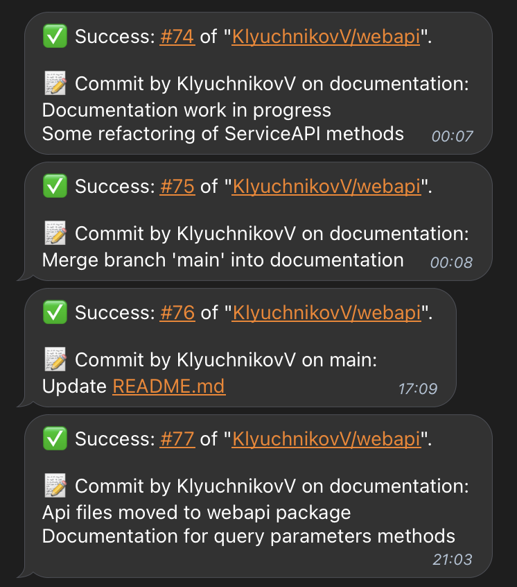

# telegram-notify

Allows you to configure the delivery of messages about the build process to Telegram

## Parameters
- `chat_id` is **required** - unique identifier for the target chat or username of the target channel;
- `token` is **required** - telegram bot token;
- `status` is **required** - status of workflow;
- `parse_mode` is _optional_ - mode for parsing entities in the message text (could be `markdown` or `markdown2` or `html`);
- `disable_links_preview` is _optional_ - disables link previews for links in this message (`true` or `false`);
- message is _optional_ - text of the message to be sent, 1-4096 characters after entities parsing.

## Usage
``` yml
notify:
    name: Notify
    needs:
        # should contain all previous jobs to run after all of them
    runs-on: ubuntu-latest
    if: always() # to run whether workflow is successful or not
    steps:
        - uses: martialonline/workflow-status@v2
        id: check
        - uses: KlyuchnikovV/telegram-notify@v0.2
        if: always()
        with:
            chat_id: ${{ secrets.TELEGRAM_CHAT_ID }}
            token: ${{ secrets.TELEGRAM_TOKEN }}
            status: ${{ steps.check.outputs.status }}
            parse_mode: markdown
            disable_links_preview: true
```

## Default message example


